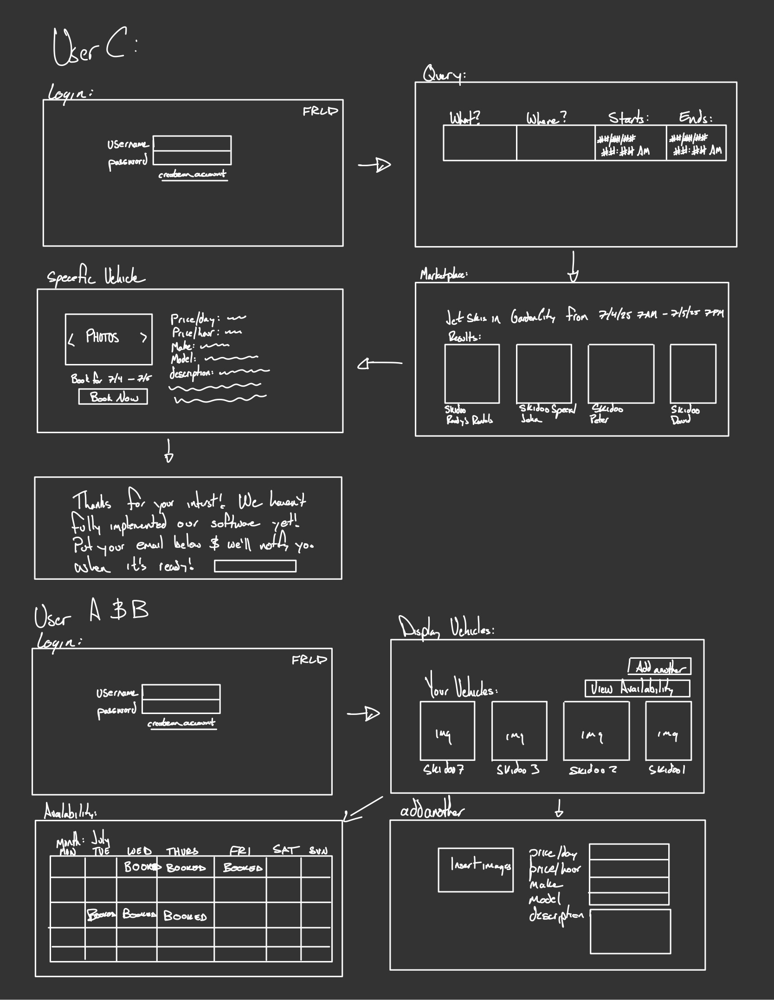
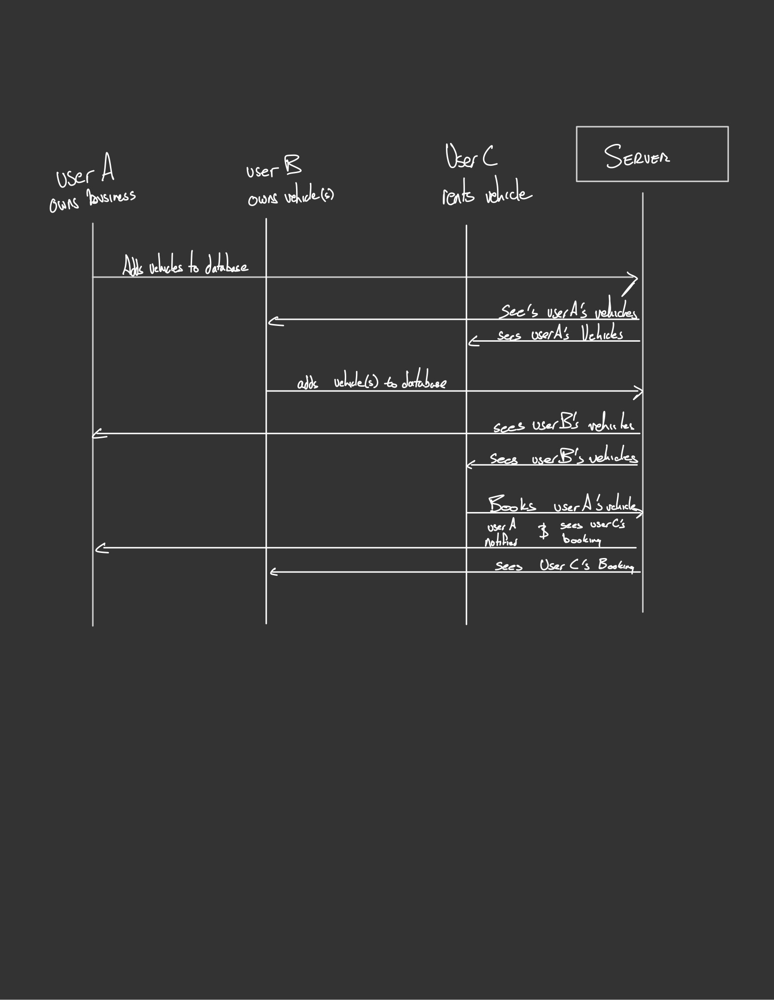

# Startup
## Elevator Pitch
Frilode will be a platform where there are 3 types of users: A) those who own recreational vehicle renting businesses, B) those who own a recreational vehicle, and C) those who want to rent a recreational vehicle. I'm connecting these 3 groups together to allow them to be more efficent. Imagine Turo but for recreational vehicles! Turo is an excellent and well built platform for renting out a personal car-- like Airbnb for cars. I want to create a website that allows and is focused on recreational vehicles. There needs to be a different platform from Turro as recreational vehicles require much more upkeep and require more attention than a car does. There isn't a platform that implements Waivers, Training videos, Insurance and Pictures for before and after. A larger database of vehicles would help business owners decide on a better price for renting, helps thier marketing, and helps with their software issues when booking multiday rentals.

## Design

## Sequence Diagram

## Key Features
- Secure Login over HTTPS
- HTML for a marketplace structure and organizing/displaying types of vehicles, ability to select a specefic vehicle to get more info on that vehicle
- CSS: great styling and animating so that the SaS looks official
- JavaScript: user needs to be able to click through the infomration on the website to see and book vehicles
- Authentication: need to have secure accounts
- Database persistence: storing user data in database (photos, info on vehicles, times booked)
- WebSocket: support for pushing data to the server and pulling data from the server (photos, info on vehicles, times booked)
- Web framework: add components and request routing
- ~~- ability to collect credit card info and bill~~
- ~~- abilit to send owners money for renters~~
- ~~- ability to book vehicle for a selected period of days, won't make it available for other users to book on same days~~
- (CC collecting beyone the scope of this class, I spoke with a TA today. I'll implement later and i'll find instructions online).
- (for now i'll take them to a landing page where i can collect thier emails and information)

<!-- Questions: 
security?
how to automate a new page so it's not hard coded? 
Is there a better liscence i can use? one that won't allow anyone to copy and profit off my code? -->

## AWS -EC2
- ssh -i ~/Documents/keys/prodFri.pem ubuntu@35.171.103.203
- Elastic IP Address: 35.171.103.203
- ls -l

## HTML deliverable

For this deliverable I built out the structure of my application using HTML.

- **HTML pages** - 10 HTML pages. 2 groups of 5 (group 1 for User C, group 2 for User A&B). Refer to drawings for what the difference is between Users A, B & C. For the user C group I added Login to Rent, Search, Results, Example vehicle, and leave your email page. For Users A&B I added Login to rent out a vehicle, a list of a user's vehicles, an avaialibility of vehicles viewer, an add vehicle page and a success page.
- **Links** - There are links to everypage in the header of every page. I did this for easy access for the grader. In reality this is not how I would set up this website. You can click through the website using the buttons as well.
- **Text** - Gives info of a specefic vehicle. you enter which vehicle you want, when and where and you can choose which one you want.
- **Images** - I included images of example jetskis. In reality this would pull from the database and allow for an A or B User to upload images.
- **DB/Login** - Secure login for user C and for users A&B. This allows users to access the main database to see available vehicles or allows users A&B to see thier vehicles and the information associated with it.
- **WebSocket** - The search page (User C) queries a DB that return infomation from realitime uploads from users A&B. The info is realtime and users can rent which pulls the avaialbe vehicle off the market for certain queries.

